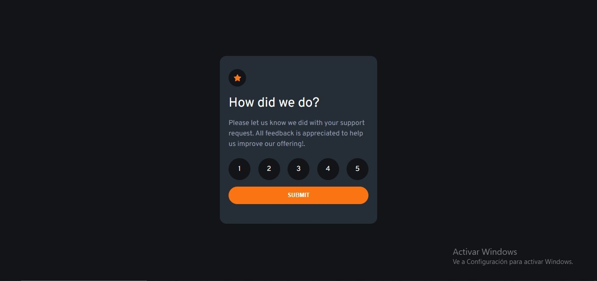

# Componente de calificacion interactivo 📱

**Este es un proyecto pequeño y agradable para practicar el manejo de las interacciones del usuario y la actualización del DOM. ¡Perfecto para cualquiera que haya aprendido los conceptos básicos de JavaScript!**

**El usuario podra realizar:**
- Seleccione y envíe una calificación numérica
- Ver el estado de la tarjeta "Gracias" después de enviar una calificación

## Link
**https://leonardo291024.github.io/Interactive-rating-component/**

